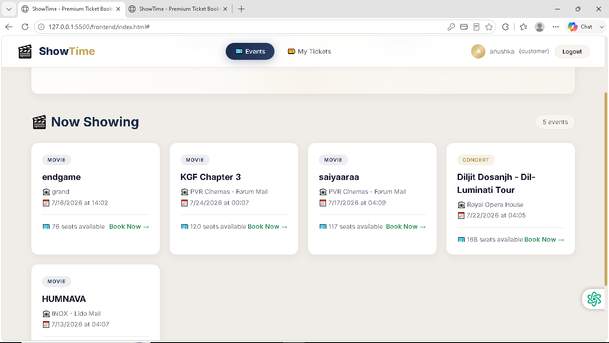
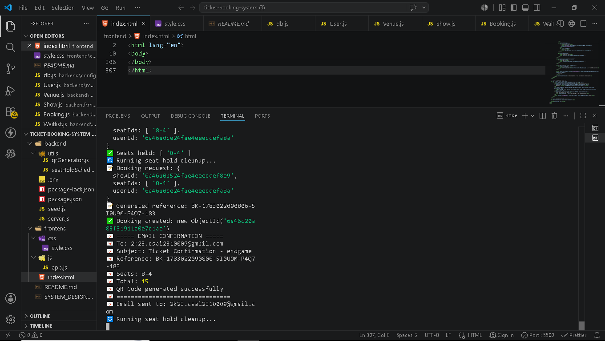

# 🎫 ShowTime - Ticket Booking System

A full-stack ticket booking platform for movies and concerts with seat holds, waitlist management, QR codes, and email confirmations.

---

## 🚀 Features

### For Customers
- ✅ Browse movies and concerts
- ✅ Visual seat map with real-time status (Available/Held/Booked)
- ✅ Seat hold with 10-minute timer
- ✅ Auto-release of abandoned holds
- ✅ Payment simulation (Card/UPI/Wallet)
- ✅ QR code ticket generation
- ✅ Email confirmation with QR code
- ✅ Booking history and cancellation
- ✅ Waitlist for sold-out events

### For Organisers
- ✅ Create and manage events
- ✅ Set venue, date, time, and pricing
- ✅ View revenue per event

### For Admins
- ✅ Create and manage venues
- ✅ Manage seat layout and categories (Premium/Standard)

---

## 🌐 Live Demo

| Service | URL |
|---------|-----|
| **Frontend (Website)** | [https://ticket-booking-system-khaki.vercel.app](https://ticket-booking-system-khaki.vercel.app) |
| **Backend API** | [https://ticket-booking-backend-99v2.onrender.com/api](https://ticket-booking-backend-99v2.onrender.com/api) |
| **GitHub Repository** | [https://github.com/ANUSHKASHUKLA09/Ticket_Booking_System](https://github.com/ANUSHKASHUKLA09/Ticket_Booking_System) |


## 🛠️ Tech Stack

| Layer | Technology |
|-------|------------|
| Backend | Node.js + Express.js |
| Database | MongoDB + Mongoose |
| Frontend | HTML + CSS + JavaScript |
| Authentication | JWT |
| Email | Nodemailer |
| QR Code | QRCode.js |
| Scheduler | node-cron |

---

## 📁 Project Structure

```
ticket-booking-system/
├── backend/
│   ├── config/
│   │   └── db.js
│   ├── models/
│   │   ├── User.js
│   │   ├── Venue.js
│   │   ├── Show.js
│   │   ├── Booking.js
│   │   └── Waitlist.js
│   ├── controllers/
│   │   └── authController.js
│   ├── routes/
│   │   ├── authRoutes.js
│   │   ├── venueRoutes.js
│   │   ├── showRoutes.js
│   │   ├── bookingRoutes.js
│   │   └── waitlistRoutes.js
│   ├── middleware/
│   │   └── auth.js
│   ├── utils/
│   │   ├── seatHoldScheduler.js
│   │   └── emailService.js
│   ├── .env.example
│   ├── package.json
│   ├── server.js
│   └── seed.js
├── frontend/
│   ├── css/
│   │   └── style.css
│   ├── js/
│   │   └── app.js
│   └── index.html
├── README.md
└── System-Design-Writeup.md
```

---

## 🔧 Installation

### Prerequisites
- Node.js (v16+)
- MongoDB (local or Atlas)
- Gmail account (for email)

### Step 1: Clone or Download
```bash
git clone https://github.com/yourusername/ticket-booking-system.git
cd ticket-booking-system
```

### Step 2: Install Backend Dependencies
```bash
cd backend
npm install
```

### Step 3: Configure Environment
```bash
cp .env.example .env
```

Update `.env` with your values:

```env
MONGO_URI=mongodb://localhost:27017/test
JWT_SECRET=your-secret-key
EMAIL_USER=your-email@gmail.com
EMAIL_PASS=your-app-password
FRONTEND_URL=http://localhost:5500
PORT=5000
```

### Step 4: Seed Admin Account
```bash
node seed.js
```

### Step 5: Start Backend
```bash
npm run dev
```

### Step 6: Open Frontend
Open `frontend/index.html` in your browser

---

## 📧 Email Setup (Gmail)
1. Enable 2-Step Verification on your Google Account
2. Go to Security → App Passwords
3. Generate an app password
4. Use it as `EMAIL_PASS` in `.env`

---

## 📋 API Documentation

### Auth Routes
| Method | Endpoint | Description |
|--------|----------|-------------|
| POST | /api/auth/register | Register user |
| POST | /api/auth/login | Login user |
| GET | /api/auth/me | Get current user |

### Venue Routes
| Method | Endpoint | Description |
|--------|----------|-------------|
| POST | /api/venues | Create venue (Admin) |
| GET | /api/venues | Get all venues |

### Show Routes
| Method | Endpoint | Description |
|--------|----------|-------------|
| POST | /api/shows | Create show (Organiser/Admin) |
| GET | /api/shows | Get all shows |
| GET | /api/shows/:id | Get show with seats |

### Booking Routes
| Method | Endpoint | Description |
|--------|----------|-------------|
| POST | /api/bookings/hold | Hold seats |
| POST | /api/bookings/release | Release held seats |
| POST | /api/bookings/confirm | Confirm booking |
| GET | /api/bookings/my-bookings | Get user bookings |
| PUT | /api/bookings/:id/cancel | Cancel booking |
| GET | /api/bookings/revenue | Revenue dashboard |

### Waitlist Routes
| Method | Endpoint | Description |
|--------|----------|-------------|
| POST | /api/waitlist/join | Join waitlist |
| GET | /api/waitlist/my-status | Get waitlist status |

---

## 📊 Database Schema

### User
```javascript
{
  name: String,
  email: String (unique),
  password: String (hashed),
  role: 'admin' | 'organiser' | 'customer',
  createdAt: Date
}
```

### Venue
```javascript
{
  name: String,
  address: String,
  totalRows: Number,
  seatsPerRow: Number,
  categories: [{ name: 'Premium' | 'Standard', priceMultiplier: Number }],
  createdBy: ObjectId,
  createdAt: Date
}
```

### Show
```javascript
{
  title: String,
  type: 'movie' | 'concert',
  date: Date,
  time: String,
  venueId: ObjectId,
  organiserId: ObjectId,
  basePrice: Number,
  seats: [{
    row: Number,
    number: Number,
    category: 'Premium' | 'Standard',
    status: 'available' | 'held' | 'booked',
    heldBy: ObjectId,
    heldUntil: Date,
    bookedBy: ObjectId
  }]
}
```

### Booking
```javascript
{
  reference: String (unique),
  userId: ObjectId,
  showId: ObjectId,
  seatIds: [String],
  totalAmount: Number,
  status: 'confirmed' | 'cancelled',
  qrCode: String,
  bookedAt: Date,
  createdAt: Date
}
```

### Waitlist
```javascript
{
  showId: ObjectId,
  userId: ObjectId,
  category: 'Premium' | 'Standard',
  status: 'waiting' | 'offered' | 'expired' | 'fulfilled',
  position: Number,
  offeredAt: Date,
  offerExpiresAt: Date
}
```

---

## 🔄 System Design Highlights

**Seat Hold TTL**
- User holds seats for 10 minutes
- Scheduler runs every minute to release expired holds
- Auto-release prevents seat blocking

**Concurrency Prevention**
- Seat status checked before each operation
- MongoDB atomic updates
- No two users can book the same seat

**Waitlist Management**
- Separate queues per show and category
- Auto-assignment on cancellation
- 15-minute time-limited offers

**QR Code**
- Generated from booking reference
- Displayed on screen + sent via email
- Scannable for venue verification

---

## 🎯 Demo Credentials
| Role | Email | Password |
|------|-------|----------|
| Admin | admin@example.com | admin123 |
| Customer | Register new account | - |

---

## 📸 Screenshots

### Login


### Events & Seat Selection



### Payment & QR Code


### My Tickets


### Admin Panel


### Email


---

## 🚀 Deployment

### Backend (Render/Railway)
1. Push to GitHub
2. Connect to Render/Railway
3. Add environment variables
4. Deploy

### Frontend (Vercel/Netlify)
1. Push to GitHub
2. Connect to Vercel/Netlify
3. Deploy

---

## 📝 License
MIT

## 👨‍💻 Author
Anushka Shukla
2k23.csai2310009@gmail.com

© 2026 ShowTime - Ticket Booking System